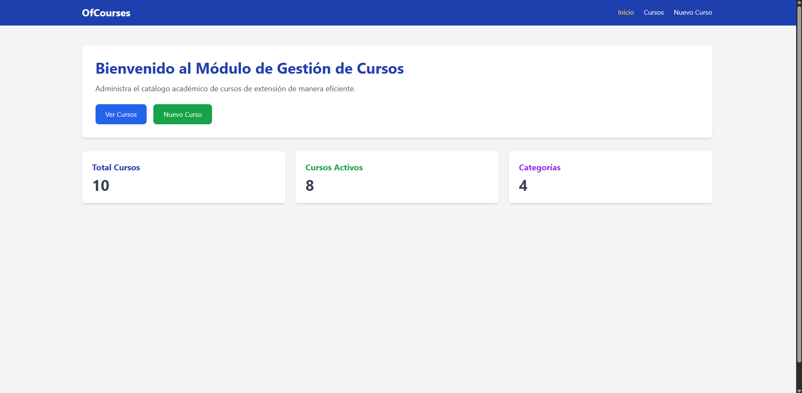
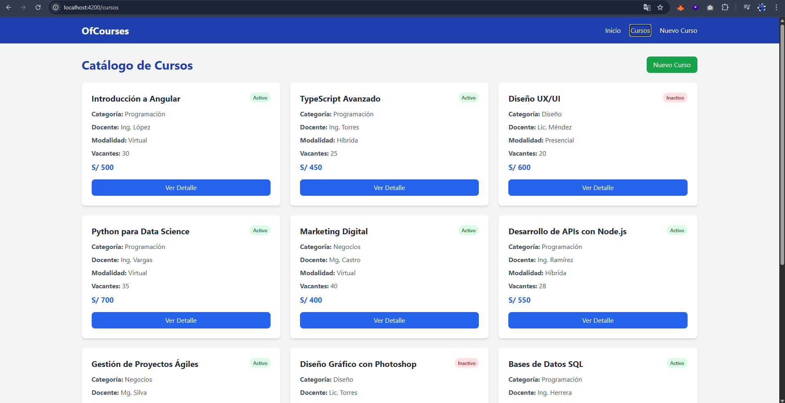
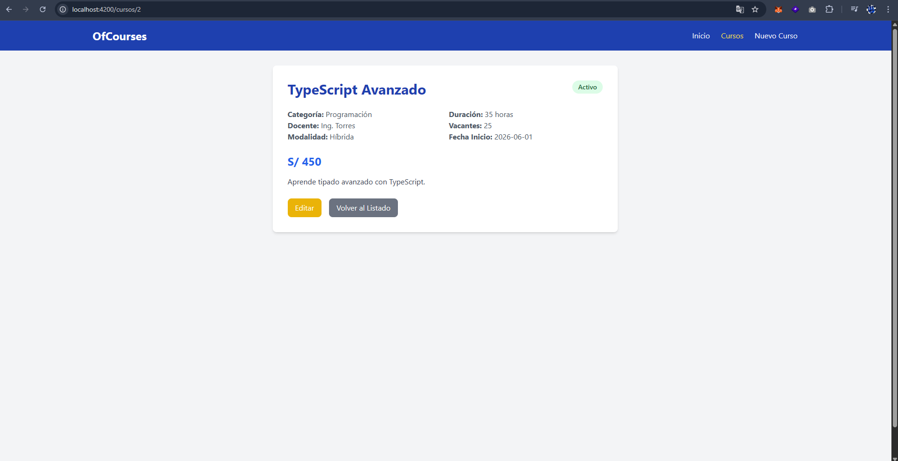
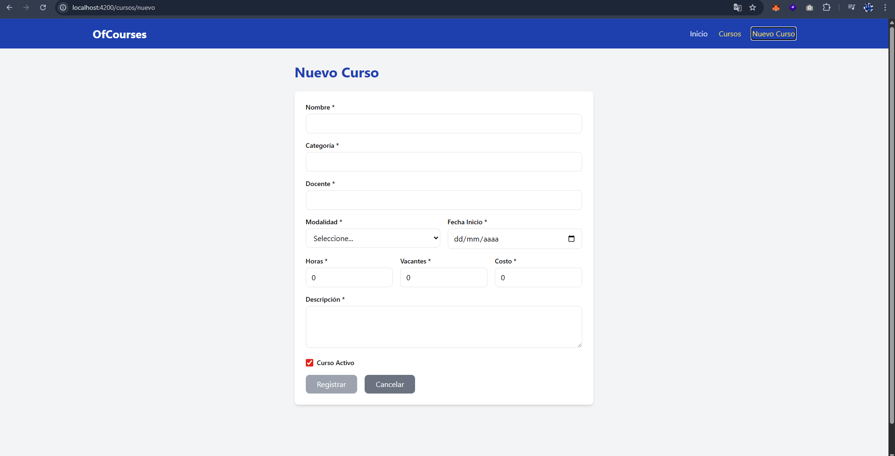

# Gestión de Cursos

Aplicación Angular 21 para gestionar un catálogo académico de cursos de extensión.

## Características

- Listar cursos con estado (activo/inactivo)
- Ver detalle de cada curso
- Registrar nuevos cursos con validación
- Editar cursos existentes
- Formularios reactivos con validaciones
- Consumo de API REST simulada
- Interfaz con Tailwind CSS

## Vistas Principales
**Vista Inicio**



**Vista Cursos**



**Vista Curso Detalle**



**Vista Nuevo Curso**




## Requisitos

- Angular CLI       : 21.2.8
- Angular           : 21.2.10
- Node.js           : 22.21.0
- Package Manager   : npm 11.13.0

## Instalación

```bash
npm install
```

## Ejecución

```bash
ng serve
```

Navega a `http://localhost:4200/`

## Estructura del Proyecto

```
src/app/
├── core/services/course.service.ts
├── shared/models/course.model.ts
├── shared/components/header/
├── features/home/
├── features/courses/course-list/
├── features/courses/course-form/
├── features/courses/course-detail/
├── app.routes.ts
└── app.ts
```

## Tecnologías

- Angular 21
- TypeScript
- Tailwind CSS v4
- Reactive Forms
- Angular Router
